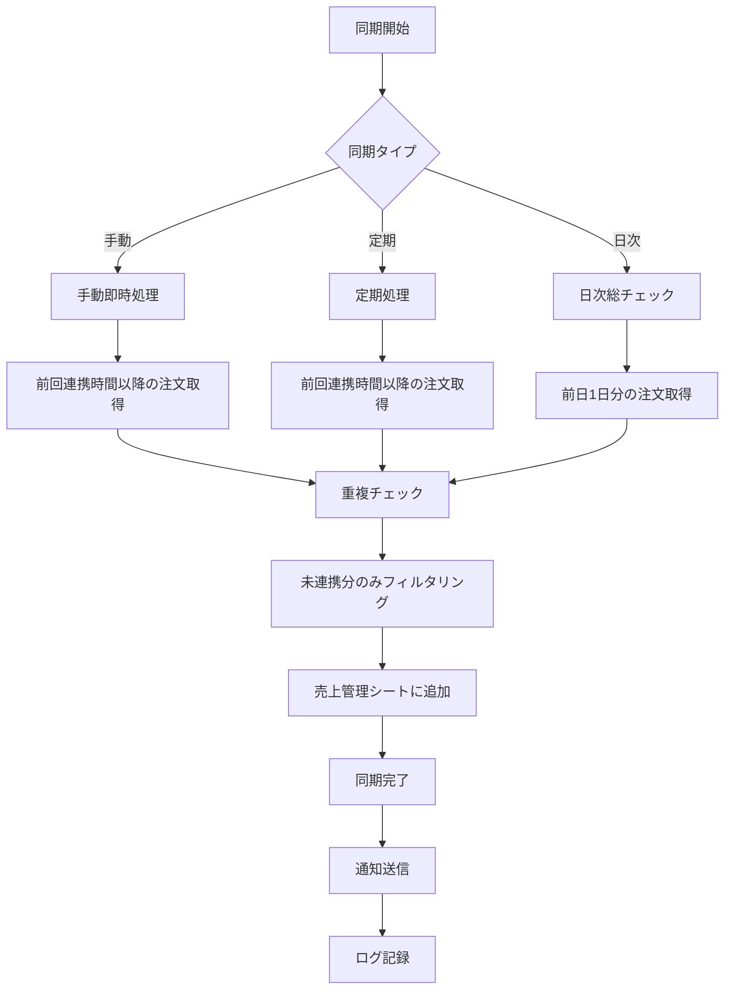

# Joom注文連携API仕様書

## 文書情報

- **文書名**: Joom注文連携API仕様書
- **バージョン**: 1.0
- **作成日**: 2025-10-07
- **最終更新日**: 2025-10-07
- **作成者**: AI Assistant
- **目的**: Joom for Merchants API v3を使用した注文連携システムの技術仕様

## 目次

1. [概要](#1-概要)
2. [API仕様](#2-api仕様)
3. [データ取得戦略](#3-データ取得戦略)
4. [同期システム設計](#4-同期システム設計)
5. [実装仕様](#5-実装仕様)
6. [エラーハンドリング](#6-エラーハンドリング)
7. [パフォーマンス最適化](#7-パフォーマンス最適化)
8. [監視・レポート機能](#8-監視レポート機能)

## 1. 概要

### 1.1 目的

Joom for Merchants API v3を使用して、Joomプラットフォームからの注文データをGoogle Sheetsの売上管理シートに自動連携するシステムの技術仕様を定義する。

### 1.2 システム要件

- **リアルタイム性**: 最新注文の迅速な同期
- **完全性**: 注文データの漏れのない取得
- **効率性**: API制限を考慮した最適な処理
- **信頼性**: エラー時の適切な処理と復旧

### 1.3 技術スタック

- **API**: Joom for Merchants API v3
- **認証**: OAuth 2.0
- **実行環境**: Google Apps Script (GAS)
- **データストレージ**: Google Sheets
- **通知**: Gmail API

## 2. API仕様

### 2.1 利用可能なエンドポイント

#### 2.1.1 単一注文取得
- **エンドポイント**: `GET /api/v3/orders`
- **用途**: 特定の注文IDでの詳細取得
- **レート制限**: 2000 rpm
- **パラメータ**: `id` (注文ID)

#### 2.1.2 複数注文取得
- **エンドポイント**: `GET /api/v3/orders/multi`
- **用途**: 複数注文の一括取得
- **レート制限**: 50 rpm
- **主要パラメータ**:
  - `limit`: 最大取得件数 (デフォルト: 100, 最大: 500)
  - `after`: ページネーション用トークン
  - `updatedFrom`: 更新日時開始 (RFC3339形式)
  - `updatedTo`: 更新日時終了 (RFC3339形式)
  - `status`: 注文ステータスフィルタ
  - `storeId`: ストアIDフィルタ

#### 2.1.3 未履行注文取得
- **エンドポイント**: `GET /api/v3/orders/unfulfilled`
- **用途**: 未履行注文のみの取得
- **レート制限**: 50 rpm
- **特徴**: 未連携の可能性が最も高い注文を効率的に取得

### 2.2 注文ステータス一覧

| ステータス | 説明 | 同期対象 |
|-----------|------|----------|
| `approved` | 承認済み - マーチャントのアクション待ち | ✓ |
| `fulfilledOnline` | オンライン履行済み - まだ配送業者に出荷マークされていない | ✓ |
| `shipped` | 出荷済み - マーチャントまたはJoom Logisticsによる出荷完了 | ✓ |
| `cancelled` | キャンセル済み - マーチャントの過失によりキャンセル | ✓ |
| `paidByJoomRefund` | Joom返金済み - Joomによってキャンセル、マーチャントは支払い受取 | ✓ |
| `refunded` | 返金済み | ✓ |
| `returnInitiated` | 返品開始 - 顧客が返品を決定 | ✓ |
| `returnExpired` | 返品期限切れ - 返品が時間内に到着しなかった | ✓ |
| `returnArrived` | 返品到着 - 返品がマーチャントに到着 | ✓ |
| `returnCompleted` | 返品完了 - マーチャントが返品を受け入れ | ✓ |
| `returnDeclined` | 返品拒否 - マーチャントが返品を拒否 | ✓ |

### 2.3 データ形式

#### 2.3.1 日時形式
- **API形式**: RFC3339形式 (UTC)
- **例**: `"2023-12-01T10:30:00Z"`
- **変換**: Google Sheets用にJST形式に変換

#### 2.3.2 価格形式
- **API形式**: 文字列（小数点区切りはドット）
- **例**: `"29.99"`
- **通貨**: ISO 4217コード (例: USD, EUR, JPY)

## 3. データ取得戦略

### 3.1 未連携注文のみの取得

Joom API v3では未連携分のみを直接取得する機能は提供されていないため、以下のアプローチを採用：

#### 3.1.1 日時ベース取得 + クライアント側フィルタリング
```javascript
// 日時範囲で注文を取得
const orders = getOrdersByDateRange(startDate, endDate);

// クライアント側で未連携分をフィルタリング
const unsyncedOrders = orders.filter(order => {
  return !isOrderAlreadySynced(order.id);
});
```

#### 3.1.2 重複チェック機能
- **注文IDベース**: 売上管理シートの注文ID列との照合
- **バッチ処理**: 効率的な一括チェック
- **エラー時処理**: エラー時は未連携として扱う

### 3.2 取得効率の最適化

#### 3.2.1 未履行注文エンドポイントの優先使用
- レート制限は50 rpmだが、未連携の可能性が最も高い
- 効率的で実用的なアプローチ

#### 3.2.2 段階的な取得戦略
1. **戦略1**: 未履行注文のみ
2. **戦略2**: 最近の注文（過去24時間）
3. **戦略3**: 過去7日間の注文

## 4. 同期システム設計

### 4.1 3層同期システム

#### 4.1.1 手動即時処理（オンデマンド）
- **実行タイミング**: ユーザーの任意のタイミング
- **取得範囲**: 前回連携時間以降の更新された注文
- **用途**: 緊急時の迅速な対応
- **実行方法**: カスタムメニューから実行
- **前回連携時間管理**: 設定シートで管理

#### 4.1.2 定期処理（1時間間隔）
- **実行タイミング**: 1時間ごとの自動実行
- **取得範囲**: 前回連携時間以降の注文
- **用途**: 自動化による継続的な同期
- **特徴**: リアルタイム性の確保
- **前回連携時間管理**: 設定シートで管理

#### 4.1.3 日次総チェック（日次バッチ）
- **実行タイミング**: 毎日午前2時
- **取得範囲**: 前日1日分の注文
- **用途**: 漏れの完全な防止
- **特徴**: システムの健全性確認

### 4.2 同期フロー



## 5. 実装仕様

### 5.1 前回連携時間管理システム

#### 5.1.1 統合管理アプローチ
手動即時処理と定期処理で共通の前回連携時間を使用することで、以下のメリットを実現：

- **データの重複防止**: 同じ時間基準で管理することで重複取得を完全に防止
- **効率性の向上**: 不要なデータ取得を削減
- **一貫性の確保**: すべての同期処理で統一された基準を使用

#### 5.1.2 実装例
```javascript
/**
 * 手動即時処理：前回連携時間以降の注文を取得
 */
function manualImmediateSync() {
  try {
    console.log('手動即時注文同期を開始します...');
    
    // 前回連携時間を取得
    const lastSyncTime = getLastSyncTime();
    const now = new Date();
    
    console.log(`前回連携時間: ${lastSyncTime.toISOString()}`);
    console.log(`現在時刻: ${now.toISOString()}`);
    
    // 前回連携時間以降の注文を取得
    const orders = getOrdersByDateRange(
      formatDateForApi(lastSyncTime),
      formatDateForApi(now)
    );
    
    if (orders.length > 0) {
      console.log(`${orders.length}件の注文を取得しました`);
      
      // 未連携分のみをフィルタリング
      const unsyncedOrders = filterUnsyncedOrders(orders);
      
      if (unsyncedOrders.length > 0) {
        batchAddOrdersToSalesSheet(unsyncedOrders);
        console.log(`${unsyncedOrders.length}件の注文を手動同期しました`);
        
        // 前回連携時間を更新
        updateLastSyncTime(now);
        
        SpreadsheetApp.getUi().alert(
          '手動同期完了',
          `${unsyncedOrders.length}件の注文を同期しました。`,
          SpreadsheetApp.getUi().ButtonSet.OK
        );
      } else {
        SpreadsheetApp.getUi().alert(
          '手動同期完了',
          '新しい注文はありませんでした。',
          SpreadsheetApp.getUi().ButtonSet.OK
        );
      }
    } else {
      SpreadsheetApp.getUi().alert(
        '手動同期完了',
        '取得可能な注文はありませんでした。',
        SpreadsheetApp.getUi().ButtonSet.OK
      );
    }
    
  } catch (error) {
    console.error('手動同期エラー:', error);
    handleApiError(error, '手動注文同期');
  }
}

/**
 * 定期処理：前回連携時間以降の注文を取得
 */
function scheduledHourlySync() {
  try {
    console.log('定期注文同期を開始します（1時間間隔）...');
    
    // 前回連携時間を取得
    const lastSyncTime = getLastSyncTime();
    const now = new Date();
    
    console.log(`前回連携時間: ${lastSyncTime.toISOString()}`);
    
    // 前回連携時間以降の注文を取得
    const orders = getOrdersByDateRange(
      formatDateForApi(lastSyncTime),
      formatDateForApi(now)
    );
    
    if (orders.length > 0) {
      // 未連携分のみをフィルタリング
      const unsyncedOrders = filterUnsyncedOrders(orders);
      
      if (unsyncedOrders.length > 0) {
        batchAddOrdersToSalesSheet(unsyncedOrders);
        console.log(`${unsyncedOrders.length}件の注文を定期同期しました`);
        
        // 通知設定が有効な場合のみ通知
        if (getSetting('Joom 同期完了通知') === 'true') {
          sendSyncNotification('定期同期', unsyncedOrders.length);
        }
      }
    }
    
    // 前回連携時間を更新（注文がなくても時間は更新）
    updateLastSyncTime(now);
    
  } catch (error) {
    console.error('定期同期エラー:', error);
    handleApiError(error, '定期注文同期');
  }
}
```

### 5.2 認証システム

#### 5.2.1 OAuth 2.0認証フロー
```javascript
function authenticateWithJoom() {
  // 1. 認証URLの生成
  const authUrl = generateAuthUrl();
  
  // 2. ユーザーに認証URLを表示
  showAuthDialog(authUrl);
  
  // 3. 認証コードの受信
  const authCode = getUserInput();
  
  // 4. アクセストークンの取得
  return exchangeCodeForToken(authCode);
}
```

#### 5.2.2 トークン管理
- **自動リフレッシュ**: 期限切れ前の自動更新
- **有効性チェック**: リクエスト前のトークン検証
- **安全な保存**: 設定シートでの暗号化保存

### 5.3 前回連携時間管理

#### 5.3.1 設定シートでの管理
```javascript
/**
 * 前回連携時間の取得
 */
function getLastSyncTime() {
  try {
    const lastSyncTimeStr = getSetting('Joom 前回連携時間');
    if (lastSyncTimeStr) {
      return new Date(lastSyncTimeStr);
    }
    
    // 初回実行時は7日前から開始
    const defaultDate = new Date();
    defaultDate.setDate(defaultDate.getDate() - 7);
    return defaultDate;
  } catch (error) {
    console.error('前回連携時間取得エラー:', error);
    return new Date(Date.now() - 7 * 24 * 60 * 60 * 1000); // 7日前
  }
}

/**
 * 前回連携時間の更新
 */
function updateLastSyncTime(syncTime) {
  try {
    updateSetting('Joom 前回連携時間', syncTime.toISOString());
    console.log(`前回連携時間を更新: ${syncTime.toISOString()}`);
  } catch (error) {
    console.error('前回連携時間更新エラー:', error);
  }
}
```

#### 5.3.2 日次総チェックの時間管理
```javascript
/**
 * 日次総チェック：前日1日分の注文を取得（前回連携時間は使用しない）
 */
function dailyComprehensiveSync() {
  try {
    console.log('日次総チェックを開始します...');
    
    // 昨日の0時から今日の0時までの注文を取得
    const yesterday = new Date();
    yesterday.setDate(yesterday.getDate() - 1);
    yesterday.setHours(0, 0, 0, 0);
    
    const today = new Date();
    today.setHours(0, 0, 0, 0);
    
    console.log(`チェック期間: ${yesterday.toISOString()} ～ ${today.toISOString()}`);
    
    // 1日分を6時間単位で分割して取得（レート制限対応）
    const syncRanges = generateHourlyRanges(yesterday, today, 6);
    
    let totalProcessed = 0;
    let totalErrors = 0;
    
    for (const range of syncRanges) {
      try {
        console.log(`期間: ${range.start} ～ ${range.end} をチェック中...`);
        
        const orders = getOrdersByDateRange(range.start, range.end);
        
        if (orders.length > 0) {
          // 未連携分のみをフィルタリング
          const unsyncedOrders = filterUnsyncedOrders(orders);
          
          if (unsyncedOrders.length > 0) {
            batchAddOrdersToSalesSheet(unsyncedOrders);
            totalProcessed += unsyncedOrders.length;
            console.log(`${unsyncedOrders.length}件の注文を日次同期しました`);
          }
        }
        
        // レート制限対応（50 rpm）
        await sleep(1200); // 1.2秒待機
        
      } catch (rangeError) {
        totalErrors++;
        console.error(`期間 ${range.start} ～ ${range.end} の処理エラー:`, rangeError);
        continue;
      }
    }
    
    console.log(`日次総チェック完了: 処理 ${totalProcessed}件, エラー ${totalErrors}件`);
    
  } catch (error) {
    console.error('日次総チェックエラー:', error);
    handleApiError(error, '日次総チェック');
  }
}
```

### 5.4 データ変換処理

#### 5.4.1 Joom API → Google Sheets マッピング

| Joom API フィールド | Google Sheets 列 | 変換処理 |
|-------------------|------------------|----------|
| `id` | 注文ID (A列) | そのまま使用 |
| `orderTimestamp` | 注文日 (B列) | RFC3339 → YYYY-MM-DD |
| `product.sku` | 商品ID (C列) | そのまま使用 |
| `priceInfo.orderPrice` | 販売価格 (H列) | 文字列 → 数値、通貨変換 |
| `shippingAddress.name` | 顧客名 (T列) | そのまま使用 |
| `status` | 注文ステータス (M列) | そのまま使用 |

#### 5.4.2 商品情報の補完
```javascript
function getProductInfoBySku(sku) {
  // 在庫管理シートから商品情報を取得
  const inventorySheet = getInventorySheet();
  const productData = findProductBySku(inventorySheet, sku);
  
  return {
    productName: productData.productName,
    sku: productData.sku,
    asin: productData.asin,
    purchasePrice: productData.purchasePrice
  };
}
```

### 5.5 利益計算

#### 5.5.1 純利益の計算
```javascript
function calculateNetProfit(order) {
  const sellingPrice = parseFloat(order.priceInfo.orderPrice);
  const commission = parseFloat(order.priceInfo.commissionAmount || 0);
  const vat = parseFloat(order.priceInfo.vat || 0);
  const refundAmount = parseFloat(order.priceInfo.refundAmount || 0);
  
  // 純利益 = 販売価格 - 手数料 - VAT + 返金額
  return sellingPrice - commission - vat + refundAmount;
}
```

## 6. エラーハンドリング

### 6.1 API エラーの分類

#### 6.1.1 認証エラー (401)
- **原因**: トークンの期限切れ、無効なトークン
- **対応**: 自動リフレッシュ、再認証プロセス

#### 6.1.2 レート制限エラー (429)
- **原因**: API制限の超過
- **対応**: 指数バックオフによる再試行

#### 6.1.3 サーバーエラー (5xx)
- **原因**: Joom側のサーバー問題
- **対応**: 一定時間後の再試行

### 6.2 エラー処理戦略

#### 6.2.1 再試行ロジック
```javascript
function makeRateLimitedRequest(endpoint, maxRetries = 3) {
  for (let attempt = 1; attempt <= maxRetries; attempt++) {
    try {
      return makeJoomApiRequest(endpoint);
    } catch (error) {
      if (error.message.includes('429') && attempt < maxRetries) {
        const delay = 1000 * Math.pow(2, attempt - 1);
        console.log(`レート制限エラー。${delay}ms待機してリトライします...`);
        Utilities.sleep(delay);
        continue;
      }
      throw error;
    }
  }
}
```

#### 6.2.2 エラーログ記録
- **売上管理シート**: 同期エラーメッセージ列に記録
- **設定シート**: エラー履歴の記録
- **メール通知**: 重要なエラーの即座通知

## 7. パフォーマンス最適化

### 7.1 レート制限対応

#### 7.1.1 制限値の遵守
- **一般エンドポイント**: 2000 rpm
- **複数取得エンドポイント**: 50 rpm
- **実装**: 適切な待機時間の設定

#### 7.1.2 バッチ処理の最適化
```javascript
function batchProcessOrders(orders, batchSize = 100) {
  for (let i = 0; i < orders.length; i += batchSize) {
    const batch = orders.slice(i, i + batchSize);
    processBatch(batch);
    
    // レート制限対応
    if (i + batchSize < orders.length) {
      Utilities.sleep(1200); // 1.2秒待機
    }
  }
}
```

### 7.2 データ処理の最適化

#### 7.2.1 重複チェックの効率化
- **Set使用**: O(1)の検索性能
- **バッチ処理**: 一括での重複チェック
- **キャッシュ**: 既存注文IDのメモリキャッシュ

#### 7.2.2 メモリ使用量の最適化
- **ストリーミング処理**: 大量データの分割処理
- **ガベージコレクション**: 適切な変数スコープ管理

## 8. 監視・レポート機能

### 8.1 同期状況の監視

#### 8.1.1 リアルタイム監視
- **同期ステータス**: 成功/失敗/進行中
- **処理件数**: 同期された注文数
- **エラー件数**: 発生したエラー数
- **最終同期日時**: 最後の同期実行時刻

#### 8.1.2 同期履歴の記録
```javascript
function recordSyncHistory(syncType, processedCount, errorCount) {
  const history = [
    new Date().toISOString(),
    syncType,
    processedCount,
    errorCount,
    errorCount === 0 ? '成功' : 'エラーあり'
  ];
  
  // 設定シートに履歴を追加
  addToSyncHistory(history);
}
```

### 8.2 レポート機能

#### 8.2.1 日次レポート
- **処理件数**: 1日で同期された注文数
- **エラー件数**: 発生したエラー数
- **同期時間**: 各同期の実行時間
- **システム状況**: 全体的な健全性

#### 8.2.2 通知システム
```javascript
function sendSyncNotification(type, count, hasError = false) {
  const email = getSetting('Joom エラー通知メール');
  if (!email) return;
  
  const subject = `Joom注文同期 ${type} - ${hasError ? 'エラー' : '完了'}`;
  const body = `
同期タイプ: ${type}
処理件数: ${count}件
ステータス: ${hasError ? 'エラーあり' : '正常'}
実行日時: ${new Date().toISOString()}
  `;
  
  MailApp.sendEmail({ to: email, subject: subject, body: body });
}
```

### 8.3 ダッシュボード機能

#### 8.3.1 同期状況確認
- **カスタムメニュー**: 同期状況の表示
- **最終同期日時**: 各同期タイプの最終実行時刻
- **次回実行予定**: 定期処理の次回実行時刻

#### 8.3.2 手動実行機能
- **即時同期**: 最新注文の手動同期
- **同期状況確認**: 現在の同期状況の表示
- **エラーログ確認**: エラー履歴の表示

## 9. セキュリティ考慮事項

### 9.1 認証情報の保護
- **暗号化保存**: アクセストークンの暗号化
- **アクセス制限**: 設定シートの保護
- **トークンローテーション**: 定期的なトークン更新

### 9.2 データ保護
- **個人情報**: 顧客情報の適切な取り扱い
- **ログ管理**: 機密情報のログ除外
- **アクセス制御**: 適切な権限管理

## 10. 運用・保守

### 10.1 定期メンテナンス
- **トークン更新**: 期限切れ前の自動更新
- **ログクリーンアップ**: 古いログの削除
- **パフォーマンス監視**: 処理時間の監視

### 10.2 トラブルシューティング
- **エラー診断**: 詳細なエラー情報の提供
- **復旧手順**: エラー時の復旧プロセス
- **サポート連絡**: 問題発生時の連絡先

## 11. 今後の拡張性

### 11.1 機能拡張
- **他プラットフォーム連携**: Amazon、楽天等の連携
- **高度な分析**: 売上分析機能の追加
- **自動化の強化**: より高度な自動処理

### 11.2 パフォーマンス向上
- **並列処理**: 複数注文の並列処理
- **キャッシュ機能**: データのキャッシュ化
- **データベース移行**: 大量データ対応

---

## 付録

### A. エラーコード一覧

| コード | 説明 | 対応方法 |
|--------|------|----------|
| 400 | 不正なリクエスト | パラメータの確認 |
| 401 | 認証エラー | トークンの更新 |
| 403 | アクセス拒否 | 権限の確認 |
| 404 | リソースが見つからない | リソースの存在確認 |
| 429 | レート制限超過 | 待機時間の調整 |
| 500 | サーバーエラー | 再試行 |

### B. 設定項目一覧

| 設定項目 | 説明 | デフォルト値 |
|----------|------|-------------|
| Joom Client ID | OAuth認証用クライアントID | - |
| Joom Client Secret | OAuth認証用クライアントシークレット | - |
| Joom Access Token | 現在のアクセストークン | - |
| Joom Refresh Token | リフレッシュトークン | - |
| Joom API Base URL | API ベースURL | https://api-merchant.joom.com/api/v3 |
| Joom 取得間隔（分） | 定期同期の間隔 | 60 |
| Joom 最大取得件数 | 1回の取得で処理する最大件数 | 100 |
| Joom 前回連携時間 | 手動・定期同期の最後の連携実行日時（共通） | - |
| Joom エラー通知メール | エラー通知先メールアドレス | - |
| Joom 同期完了通知 | 同期完了時の通知フラグ | true |

### C. 参考資料

- [Joom for Merchants API v3 公式ドキュメント](https://merchant.joom.com/docs/api/v3)
- [Joom API v3 Get Order 詳細資料](./Joom_API_v3_Get_Order_詳細資料.md)
- [Joom API v3 Orders Multi 詳細資料](./Joom_API_v3_Orders_Multi_詳細資料.md)
- [OAuth 2.0仕様](https://tools.ietf.org/html/rfc6749)

---

*この文書は、Joom for Merchants API v3を使用した注文連携システムの技術仕様を定義しています。最新の情報については、必ず公式ドキュメントを参照してください。*
