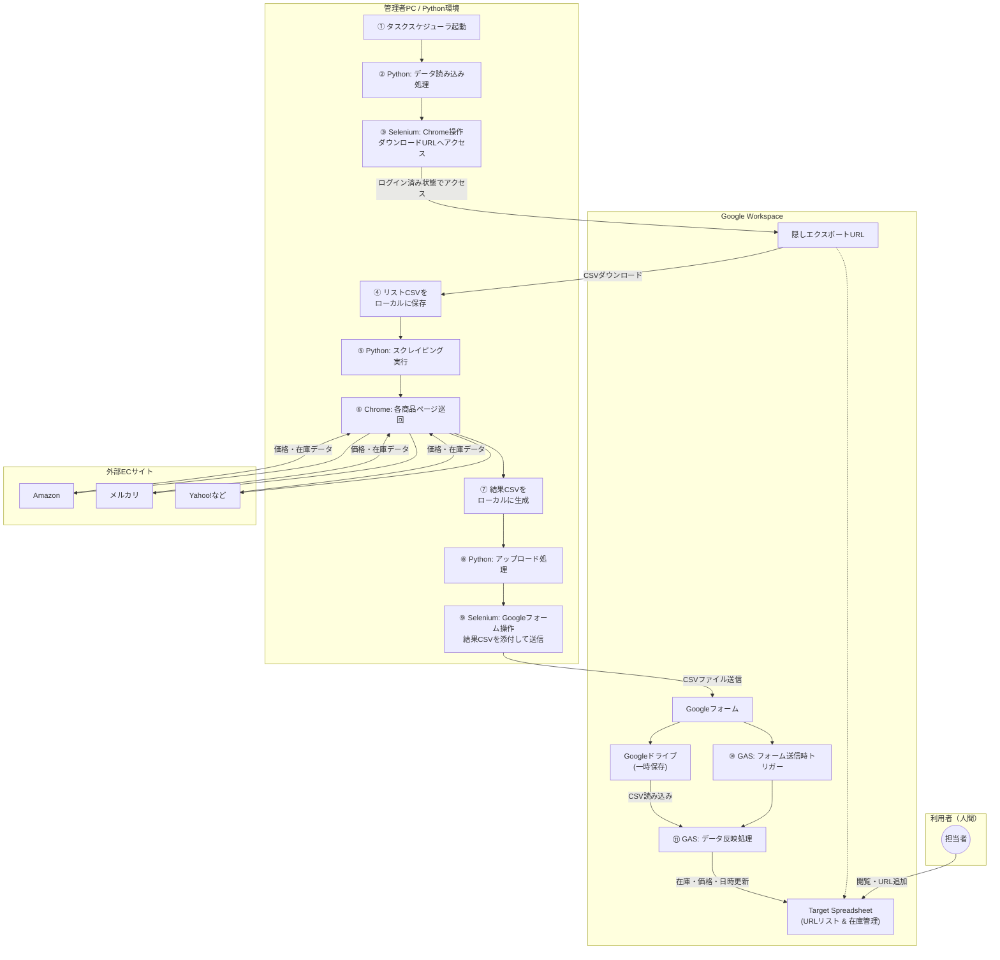

```mermaid
graph TD
    %% 定義: 登場人物とエリア
    subgraph User_Area ["利用者（人間）"]
        User(("担当者"))
    end

    subgraph Local_PC ["管理者PC / Python環境"]
        Scheduler["① タスクスケジューラ起動"]
        Py_Read["② Python: データ読み込み処理"]
        Chrome_DL["③ Selenium: Chrome操作<br>ダウンロードURLへアクセス"]
        Local_CSV_IN["④ リストCSVを<br>ローカルに保存"]
        
        Py_Scrape["⑤ Python: スクレイピング実行"]
        Chrome_Scrape["⑥ Chrome: 各商品ページ巡回"]
        Local_CSV_OUT["⑦ 結果CSVを<br>ローカルに生成"]
        
        Py_Upload["⑧ Python: アップロード処理"]
        Chrome_Form["⑨ Selenium: Googleフォーム操作<br>結果CSVを添付して送信"]
    end

    subgraph Cloud_Google ["Google Workspace"]
        MasterSheet["Target Spreadsheet<br>(URLリスト & 在庫管理)"]
        ExportURL["隠しエクスポートURL"]
        G_Form["Googleフォーム"]
        G_Drive["Googleドライブ<br>(一時保存)"]
        GAS_Trigger["⑩ GAS: フォーム送信時トリガー"]
        GAS_Update["⑪ GAS: データ反映処理"]
    end

    subgraph Web_Sites ["外部ECサイト"]
        Amazon["Amazon"]
        Mercari["メルカリ"]
        Yahoo["Yahoo!など"]
    end

    %% フローの接続
    User -- "閲覧・URL追加" --> MasterSheet
    
    Scheduler --> Py_Read
    Py_Read --> Chrome_DL
    Chrome_DL -- "ログイン済み状態でアクセス" --> ExportURL
    ExportURL -.-> MasterSheet
    ExportURL -- "CSVダウンロード" --> Local_CSV_IN
    
    Local_CSV_IN --> Py_Scrape
    Py_Scrape --> Chrome_Scrape
    
    Chrome_Scrape --> Amazon
    Chrome_Scrape --> Mercari
    Chrome_Scrape --> Yahoo
    
    Amazon -- "価格・在庫データ" --> Chrome_Scrape
    Mercari -- "価格・在庫データ" --> Chrome_Scrape
    Yahoo -- "価格・在庫データ" --> Chrome_Scrape
    
    Chrome_Scrape --> Local_CSV_OUT
    
    Local_CSV_OUT --> Py_Upload
    Py_Upload --> Chrome_Form
    Chrome_Form -- "CSVファイル送信" --> G_Form
    
    G_Form --> G_Drive
    G_Form --> GAS_Trigger
    GAS_Trigger --> GAS_Update
    G_Drive -- "CSV読み込み" --> GAS_Update
    GAS_Update -- "在庫・価格・日時更新" --> MasterSheet
```